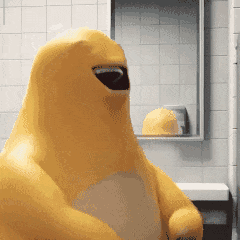

# 奶蛙

[简体中文] |
[English](./README_en-US.md)

奶蛙宇宙 <a href="https://wencuecryforme.github.io/NaiWa-Universe/" target="_blank">点击此处前往</a>

---

## 奶蛙是什么？

你连奶蛙都不知道？

[去观看奶蛙的爆笑视频](https://wencuecryforme.github.io/NaiWa-Universe/files/video/奶蛙爆笑合集/奶蛙爆笑.mp4) 。

## 表情包

- 统一文件格式: `.jpg` `.gif`
- dist 级: 500KB/2MB以下的压缩版本,存放于 `dist/meme/` 目录
- raw 级: 生成与传播时的未压缩版本,不直接包括在仓库内容中
- dist 级与 raw 级均随某个版本 Release 发布,归档列表见 [**表情包归档清单文档**](docs/meme-list.md)

## 贡献指南

参见 [CONTRIBUTING.md](./CONTRIBUTING.md)

## 许可证

本仓库采用 [MIT 许可证](./LICENSE)

## 版权信息

Copyright &copy; 2026 Nobody

详见 [COPYRIGHT](./COPYRIGHT)

## 友情链接

- 奶蛙档案馆: https://www.naiwa.world/
- 奶蛙爆笑视频游戏: https://xinyewebsite.com/games/milk-frog/
